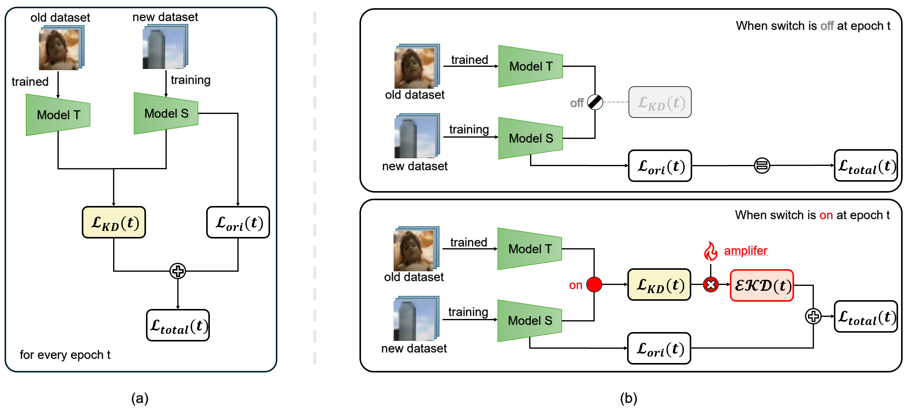

# Towards Efficient Continual Learning: Strategies on Utilizing Knowledge Distillation Loss



## How To Use
Clone this github repository:
```
git clone https://github.com/rkdrn79/EKD.git
cd EKD
```

<details>
  <summary>Optionally, create an environment to run the code (click to expand).</summary>

  ### Using a requirements file
  The library requirements of the code are detailed in [requirements.txt](requirements.txt). You can install them
  using pip with:
  ```
  python3 -m pip install -r requirements.txt
  ```

  ### Using a conda environment
  Development environment based on Conda distribution. All dependencies are in `environment.yml` file.

  #### Create env
  To create a new environment check out the repository and type: 
  ```
  conda env create --file environment.yml --name EKD
  ```
  *Notice:* set the appropriate version of your CUDA driver for `cudatoolkit` in `environment.yml`.

  #### Environment activation/deactivation
  ```
  conda activate EKD
  conda deactivate
  ```

</details>

To run the basic code:
```
python3 -u src/main_incremental.py
```
More options are explained in the [`src`](./src), including GridSearch usage. Also, more specific options on approaches,
loggers, datasets and networks.